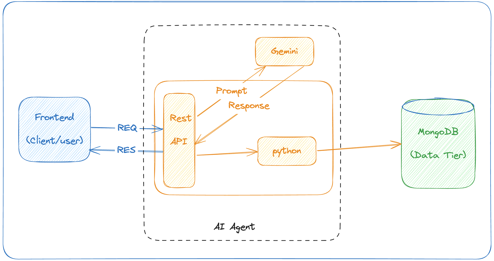

# SaaS using Gemini GenAI to Implement an AI Agent

## About
This code is an attempt to replace the traditional CRUD business logic in 3-tier applications with an AI Agent that uses [Gemini AI](https://gemini.google.com/app) as the GenAI Engine.

For the purpose of this research, I have tried to implement a simple Expense Tracker application with a basic GET and POST REST operations.

## Overview
Following the recent prediction statement from Satya Nadella on SaaS, stating:
> "...these applications are essentially CRUD (create, read, update and delete) databases with business logic. But in future, this logic will migrate to AI agents."

This is an attempt to implement that vision or idea based on my interpretation of it.

**Note:** There are more advanced and purpose-built AI Agents. However, this is one among the many possible approaches and patterns to realizing the idea that I wanted to experiment with.

## Architecture Diagram


## Setup Instructions

1. Create a Python virtual environment and activate it:
   ```bash
   python -m venv env
   source env/bin/activate
   ```
2. Install the required packages:
   ```bash
   pip install -r requirements.txt
   ```
   
3. Install FastAPI:
   Refer to the [FastAPI Documentation](https://fastapi.tiangolo.com/) for more details.
   ```bash
   pip install fastapi
   ```
4. Install and run MongoDB locally:

   Follow the guide to install MongoDB Community Edition with Docker: [MongoDB Installation Guide](https://www.mongodb.com/docs/manual/tutorial/install-mongodb-community-with-docker/).

5. Update the `local.env` file:
   - Add your Gemini API key.

6. Load the API keys into environment variables
   ```bash
   source ./local.env
   ```

7. Update the MongoDB connection string:
   - Modify `prompts.py` if required to use your local MongoDB instance connection string.

8. Launch the backend / business logic on FastAPI:
   ```bash
   fastapi dev main.py
   ```
   Access the Swagger UI at: `http://127.0.0.1:8000/docs`

   Access the API at: `http://127.0.0.1:8000/`

## Credits
The AI-based Python code generation and execution logic has been adapted from a similar implementation for ChatGPT by [RodgerE1](https://gist.github.com/RodgerE1/9339c6ea0c851e48d41b852b80834d98).
